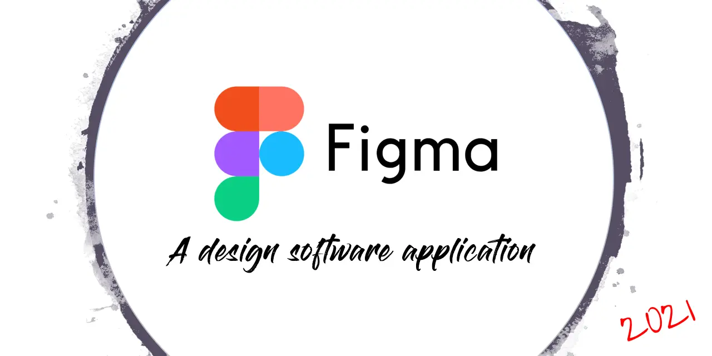
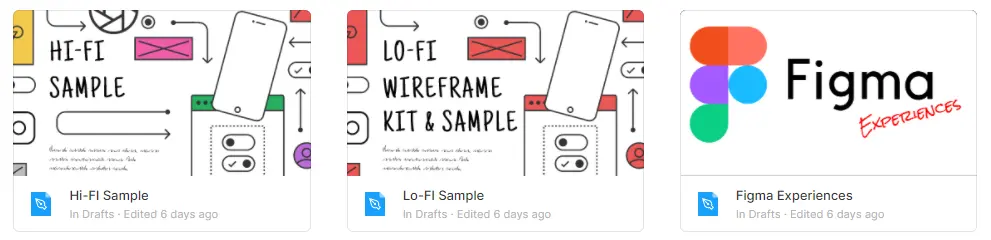
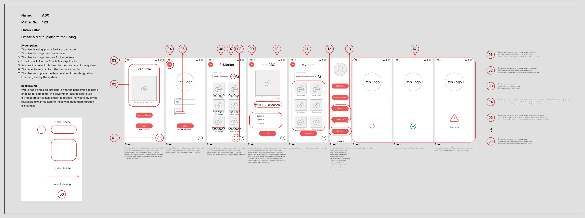
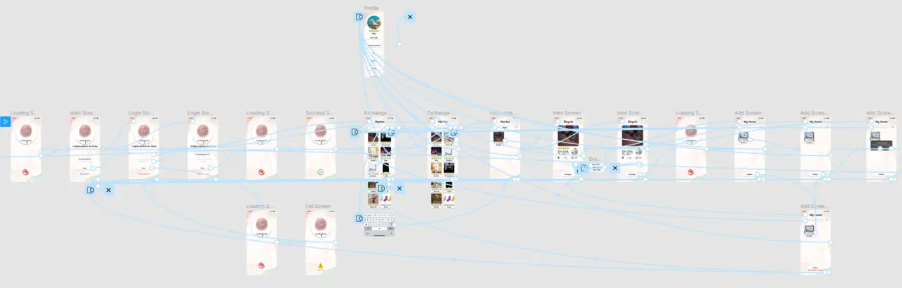
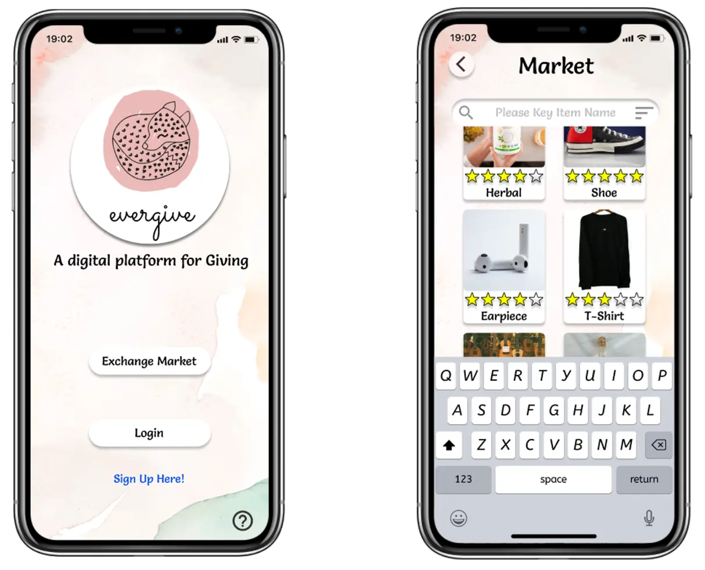
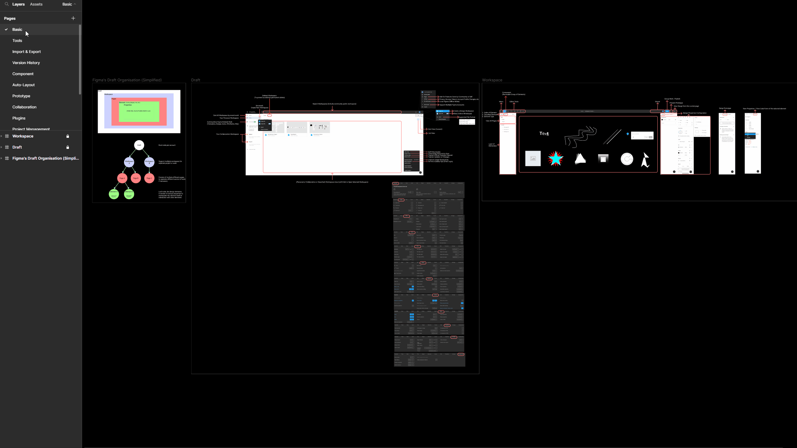

# Figma Academic 2021

## What?

One of my work with NTU as a part-time job. The task is to provide an alternative design tools called "Figma" for student to get their hands-on experiences and plan to be integrated as part of the curriculum module

## Why?

1. Create an alternative options NTU's SCSE assessment and exposure of design UI to prototyping with the given samples.
2. Research on additional tips and tricks to improve productivity.
3. Explore all possible feature Figma has to offered and simplified them for teaching purpose.

## How?

1. Read through all documentations and hands-on findings
2. Research on seasonal experts for tips and tricks
3. Plan and setup content workflow design for student
4. Plan and setup possible assessment for student
5. Refined and vetting content
6. Approval and submission

## Features

### Lo-fi Design Sample

\
https://www.figma.com/file/13qYRZN92mGLN8sPKUzDKU/Lo-FI-Sample

### Hi-fi Design Sample

\
https://www.figma.com/file/vMmiKdc4FLWd8sohztm8n1/Hi-FI-Sample

### Prototype

\
https://www.figma.com/proto/vMmiKdc4FLWd8sohztm8n1/Hi-FI-Sample

### Informative Guidelines

Basic, Tools, Import & Export, Version History, Component, Auto-Layout, Prototype, Collaboration, Plugins

\
https://www.figma.com/file/0naRojethoXdUjP9jYJ7Pa/Figma-Experiences

## Disclaimer

All external data and assets in this project used is intended for educational purpose only.

## Credits

I would like to thank Dave Whitley for creating a robust library that help Lo-Fi design work seamlessly.
https://www.lofiwireframekit.com/

## Contributor

Figma Academic Team
